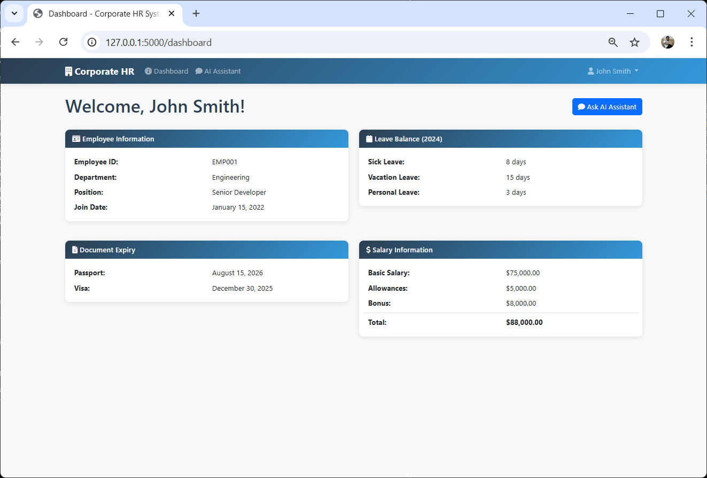

# Corporate Chat Assistant - AI-Powered HR System

## Project Overview
This is a corporate chatbot Proof of Concept (POC) built entirely with **Python frameworks** and **OpenAI LLMs**—no low-code or no-code tools. The system leverages a multi-agent AI architecture where specialized agents handle classification and reasoning tasks to provide employees with intelligent, context-aware responses to their HR queries.

### What Makes This Different
- **Agent-Based Architecture**: Uses dedicated AI agents for intent classification and response generation
- **Custom-Built Solution**: Pure Python implementation using Flask and OpenAI APIs
- **Privacy-Focused**: Built-in guardrails prevent employees from accessing other employees' information
- **Employee-Centric**: Each logged-in employee can only query their own HR data

## Screenshots

<details>
<summary>Click to view application screenshots</summary>

### Login Screen


### Employee Dashboard


### AI Chat Assistant


### Chat Conversation


</details>

## Technology Stack
- **Backend**: Flask (Python web framework), SQLAlchemy (ORM)
- **Database**: SQLite
- **AI/LLM**: OpenAI GPT-4o-mini
- **Frontend**: HTML5, CSS3, JavaScript (ES6+), Bootstrap 5
- **Security**: Werkzeug password hashing, session-based authentication
- **Environment Management**: python-dotenv

## AI Agent Architecture

This system implements a **two-phase agent pipeline** that processes user queries:

### Phase 1: Classification Agent
- **Purpose**: Intent recognition and parameter extraction
- **Model**: GPT-4o-mini (temperature: 0.1 for deterministic results)
- **Function**: Analyzes user queries to identify intent (leave balance, salary, documents, etc.)
- **Output**: Structured JSON with `intent` and `parameters`
- **Recognized Intents**:
  - `leave_balance` - Leave queries
  - `salary_info` - Salary information
  - `passport_expiry`, `visa_expiry`, `id_card_expiry`, `document_expiry` - Document queries
  - `user_info` - Employee personal details (department, position, tenure, joining date, employee ID)
  - `general_info` - General HR queries
  - `other_employee_info` - **Blocked intent** (guardrail activated)

### Phase 2: Reasoning & Response Agent
- **Purpose**: Generate contextual, natural language responses
- **Model**: GPT-4o-mini (temperature: 0.3 for conversational variety)
- **Function**: Combines database query results with conversational context
- **Output**: Human-friendly responses tailored to the employee

### Security Guardrails
The system implements multiple security layers:
1. **Session-based authorization** - Only authenticated users can access the chat
2. **User-scoped queries** - Database queries are filtered by logged-in user ID
3. **Intent-level blocking** - Queries about other employees are detected and rejected
4. **Input validation** - Message length limits and sanitization

## Project Structure
```
CorporateChatbot/
├── app.py                 # Main Flask application
├── requirements.txt       # Python dependencies
├── .env                  # Environment variables (API keys)
├── models.py             # Empty (models defined in app.py)
├── database.py           # Empty (database logic in app.py)
├── templates/            # Jinja2 templates
│   ├── base.html
│   ├── login.html
│   ├── dashboard.html
│   └── chat.html
├── static/               # Static assets
│   ├── css/style.css
│   └── js/chat.js
├── instance/             # SQLite database storage
├── venv/                 # Python virtual environment
└── .vscode/              # VS Code configuration
```

## Database Models
- **User**: Employee information, credentials, department details
- **LeaveBalance**: Annual leave balances (sick, vacation, personal)
- **Documents**: Document expiry tracking (passport, visa, ID)
- **SalaryInfo**: Salary breakdown and history

## Key Features

### Core Functionality
1. **Secure Authentication**: Session-based login with Werkzeug password hashing
2. **Employee Dashboard**: Comprehensive overview of personal HR data
3. **AI-Powered Chat Interface**: Natural language query processing
4. **Multi-Agent AI System**:
   - Classification agent for intent recognition
   - Reasoning agent for response generation
5. **Real-time Database Integration**: Dynamic querying of employee records
6. **Privacy Guardrails**: Prevents unauthorized access to other employees' data

### What Employees Can Query
- **Leave balances** (sick leave, vacation, personal days)
- **Salary information** (basic salary, allowances, bonuses)
- **Document expiry dates** (passport, visa, ID card)
- **Personal employment details** (department, position, employee ID, joining date, tenure)
- **General HR information** and company policies

## Setup Instructions

### 1. Environment Setup
```bash
# Activate virtual environment
.\venv\Scripts\activate  # Windows
source venv/bin/activate  # Linux/Mac

# Install dependencies
pip install -r requirements.txt
```

### 2. Configuration
Ensure `.env` file contains:
```
OPENAI_API_KEY=your_openai_api_key_here
FLASK_SECRET_KEY=your_secret_key_here
```

### 3. Database Initialization
The database is automatically initialized with sample data on first run.

### 4. Running the Application
```bash
python app.py
```
The application runs on http://localhost:5000

## Sample Credentials
- **Employee 1**: emp1 / emp1 (John Smith - Engineering)
- **Employee 2**: emp2 / emp2 (Sarah Johnson - Marketing)

## AI Chat Capabilities

### Example Queries the Assistant Can Handle
- **Leave Balances**:
  - "How many sick days do I have left?"
  - "What's my vacation balance for this year?"
  - "Do I have any personal days remaining?"

- **Salary Information**:
  - "What's my current salary?"
  - "Show me my salary breakdown"
  - "What allowances do I receive?"

- **Document Expiry**:
  - "When does my passport expire?"
  - "Is my visa still valid?"
  - "Check my ID card expiry date"

- **Personal Employment Information**:
  - "What's my employee ID?"
  - "What department am I in?"
  - "What is my designation?" or "What's my position?"
  - "When did I join the company?"
  - "How long have I been working here?" or "What's my tenure?"
  - "What's my email address?"

### Queries the Assistant Will Block (Guardrails)
- "What is John's salary?" ❌ **Blocked** - Cannot access other employees' data
- "Show me Sarah's leave balance" ❌ **Blocked** - Privacy violation
- Any query about another employee's personal information ❌ **Blocked**

## Development Commands
```bash
# Run application
python app.py

# Install new dependencies
pip install package_name
pip freeze > requirements.txt

# Database reset (if needed)
# Delete instance/hr_system.db and restart app
```

## API Endpoints
- `GET /` - Redirect to dashboard or login
- `GET /login` - Login page
- `POST /login` - Authenticate user
- `GET /logout` - Clear session
- `GET /dashboard` - Employee dashboard
- `GET /chat` - Chat interface
- `POST /api/chat` - Chat API endpoint

## Security Features

### Authentication & Authorization
- **Password Security**: Werkzeug PBKDF2 SHA-256 hashing for stored passwords
- **Session Management**: Flask secure session cookies with secret key
- **Route Protection**: Login required decorators on sensitive endpoints
- **Authorization Checks**: User ID verification on all data queries

### Data Privacy Guardrails
- **Intent-Level Blocking**: AI agent identifies and rejects queries about other employees
- **Database Query Scoping**: All queries filtered by `user_id` from session
- **Cross-Employee Protection**: Built-in prevention of lateral data access
- **Input Validation**: Message length limits (500 chars) and sanitization

### API Security
- **Session Validation**: All API endpoints verify active user session
- **Error Handling**: Generic error messages to prevent information disclosure
- **CSRF Protection**: Session-based approach with same-origin policy

## Future Enhancements
- Role-based access control (HR admin, managers, employees)
- Leave request and approval workflow
- Document upload and management features
- Email/SMS notification system
- Advanced analytics and reporting dashboards
- Multi-language support
- Integration with external HR systems (SAP, Workday, etc.)
- Voice interface for accessibility
- Mobile application

## Project Status

This is a **Proof of Concept (POC)** demonstrating:
- How AI agents can be used for intent classification and reasoning
- Integration of OpenAI LLMs with Python frameworks (Flask, SQLAlchemy)
- Implementation of security guardrails to protect employee data
- A complete end-to-end HR chatbot solution without low-code/no-code tools

### Important Notes
- This POC uses SQLite for simplicity; production deployments should use PostgreSQL/MySQL
- The OpenAI API key should be properly secured using environment variables
- Sample data is provided for demonstration purposes only
- Additional security hardening recommended for production use

## Contributing
This is a personal POC project. Feel free to fork and adapt for your own use cases.

## License
This project is licensed under the MIT License - see the [LICENSE](LICENSE) file for details.

---

**Built with Python, Flask, OpenAI, and SQL** | **No low-code/no-code tools used**